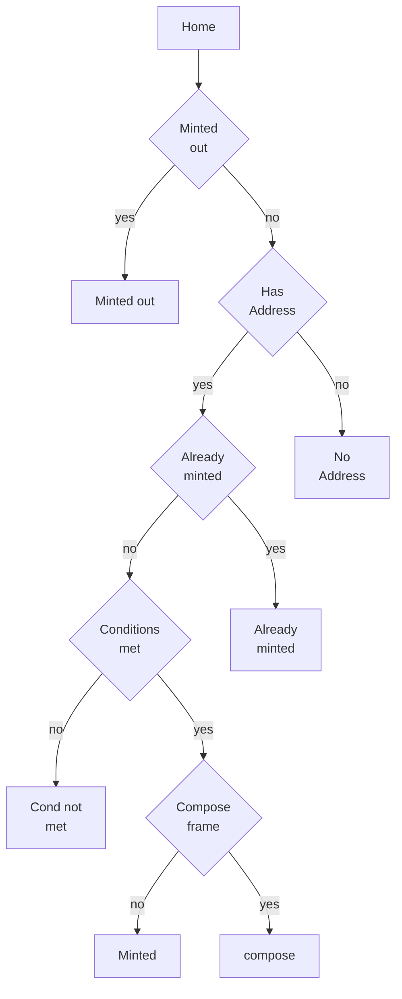

# Gated Minting

## Flow

## Pages
- Home: static
- Minted out: static
- Already minted: static
- No address: static
- Conditions not met: dynamic
- Minted: static

## Custom logic
- Minted out: boolean
- Already minted: boolean
- Conditions met: boolean + payload for dynamic conditions not met page
- Mint: void 

## Compose query params
* `compose-frame-url`: url to push to instead of minting of it exists
