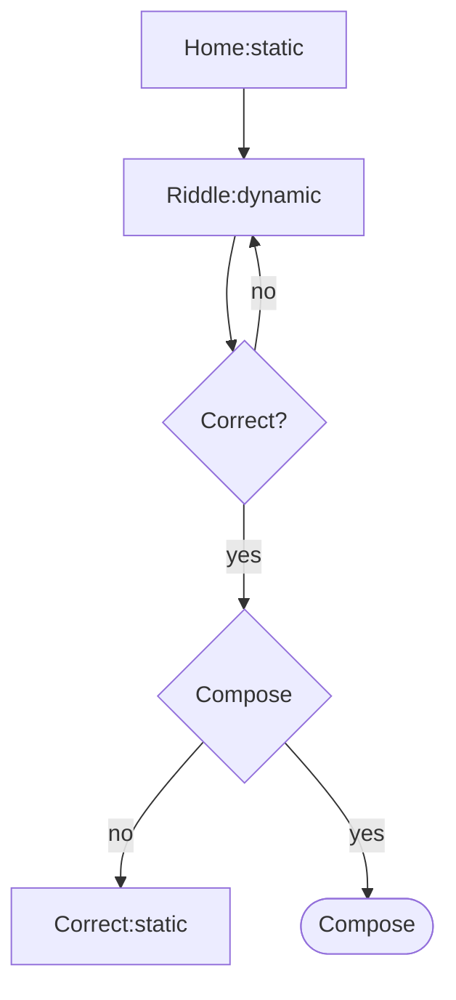

```mermaid
flowchart TD
    A[Home:static] --> B[Riddle:dynamic] 
    B --> C{Correct?}
    C --"no"--> B
    C --"yes"--> E{Compose}
    E --"no"--> F[Correct:static]
    E --"yes"--> id1([Compose])
```

