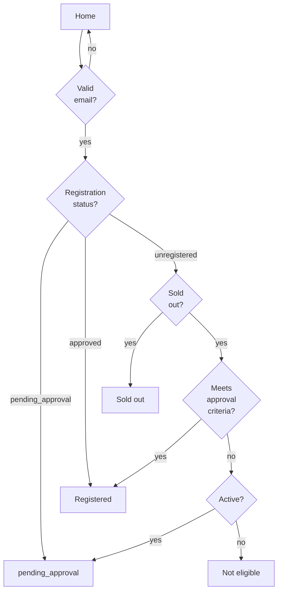

# RSVP 

## Flow

```mermaid
flowchart TD
    A[Home] --> B{Valid\nemail?} 
    B --"yes"--> C{Registration\nstatus?}
    B --"no"--> A
    C --"pending_approval"--> D[pending_approval]
    C --"approved"--> E[Registered]
    C --"unregistered"--> F{Sold\nout?}
    F --"yes"--> H[Sold out]
    F --"yes"--> G{Meets\napproval\ncriteria?}
    G --"yes"--> E 
    G --"no"--> I{Active?}
    I --"yes"--> D 
    I --"no"--> J[Not eligible]
```
